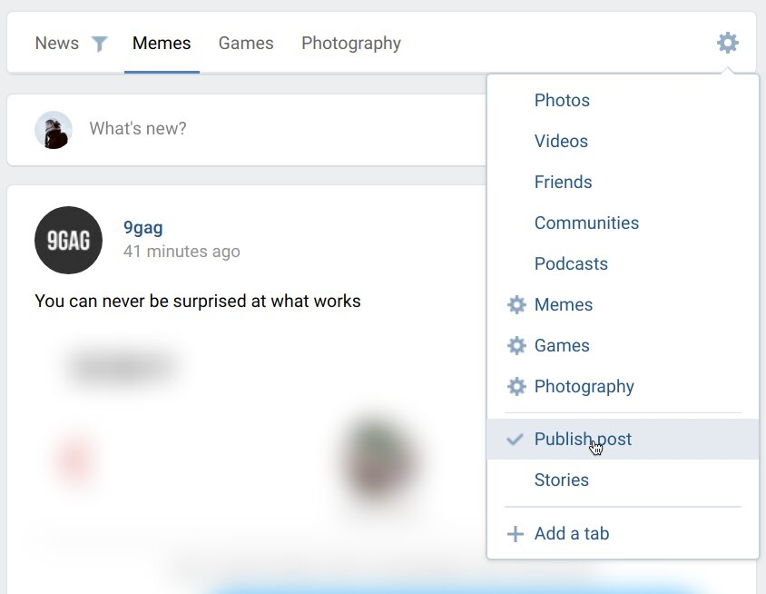

<h1>VK Tabby Tabs <b>β</b></h1>

> This userscript converts right side menu to the tabs at the top of central news column, and also allows to hide stories and posting block, which allows to focus on current news tab only.

    

## Features

- Hide stories and new post creation blocks
  - Stories hiding integrates with VkOpt
- Ability to hide tabs by surrounding the name `.*such way*.`
  - Toggle hidden tabs holding <kbd>Ctrl</kbd> key and clicking on empty space
  - This integrates with my other script — VK List Add

## How to use?

First you need to install this script using preferred userscript manager extension (like [Tampermonkey](https://www.tampermonkey.net/), [Greasemonkey](https://www.greasespot.net/), [Violentmonkey](https://violentmonkey.github.io/)). Pressing the following button will open an installation window.

Reload VK pages after installation, at the top of feed tabs must show up for all selected either default or manually created tabs. Pressing the gear icon will open tabs settings menu.

## ⚠️ Reporting issues

**Caution about beta version**: altrough that most of the work on script is done, you still can catch some bugs.

If script is not working or behaving incorrectly, or you have questions, please use [Issues section on GitHub →](https://github.com/Sasha-Sorokin/vk_tabbytabs/issues)

## See also:

- [VK List Add](https://github.com/Sasha-Sorokin/vklistadd) — easy and handy script for adding people and communities to the newsfeed lists, without the need to subscribe.