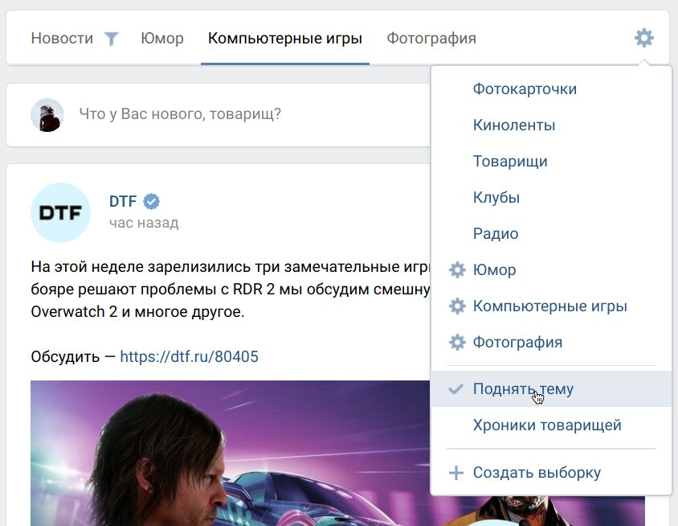

<h1>VK Tabby Tabs <b>β</b></h1>

> Этот юзерскрипт преобразует меню списков новостей во вкладки поверх центральной колонки, а также позволяет скрывать блок историй и написания новой записи, что позволяет сфокусироваться исключительно на текущей вкладке с новостями.

    

## Возможности

- Скрытие блока историй и написания нового поста
  - Скрытие историй интегрируется с расширением VkOpt
- Создание скрытых вкладок путём обрамления названия `.*подобным образом*.`
  - Переключайте отображение скрытых вкладок, зажав <kbd>Ctrl</kbd> и кликнув на пустом месте
  - Интеграция со скриптом VK List Add
- ~~Нескучные обои~~

## Как использовать?

Первым делом вам нужно будет установить этот скрипт через предпочтительное расширение (например, [Tampermonkey](https://www.tampermonkey.net/), [Greasemonkey](https://www.greasespot.net/) или [Violentmonkey](https://violentmonkey.github.io/)). Нажатие следующей кнопки откроет окно установки:

Перезагрузите страницы ВКонтакте после установки, сверху ленты должны появиться вкладки для всех выбранных стандартных и вручную созданных списков новостей, нажатие на шестерню откроет меню настройки вкладок.

## ⚠️ Сообщения об ошибках

**Предупреждение о бета версии**: несмотря на то, что большинство работы над скриптом завершено, вы всё ещё можете наткнуться на те или иные ошибки.

Если скрипт не работает или работает неправильно, у вас есть вопросы, используйте секцию [Issues на GitHub →](https://github.com/Sasha-Sorokin/vk_tabbytabs/issues)

### Известные проблемы:

- В Chromium браузерах может неправильно работать выделение текущей вкладки, если скрипт установлен в паре с другим скриптом — **RU AdList JS Fixes**. Его отключение на сайте ВКонтакте должно решить проблему.

## Посмотрите также:

- [VK List Add](https://github.com/Sasha-Sorokin/vklistadd) — скрипт для простого и удобного добавления людей и сообществ в списки новостей, в том числе и без подписок.